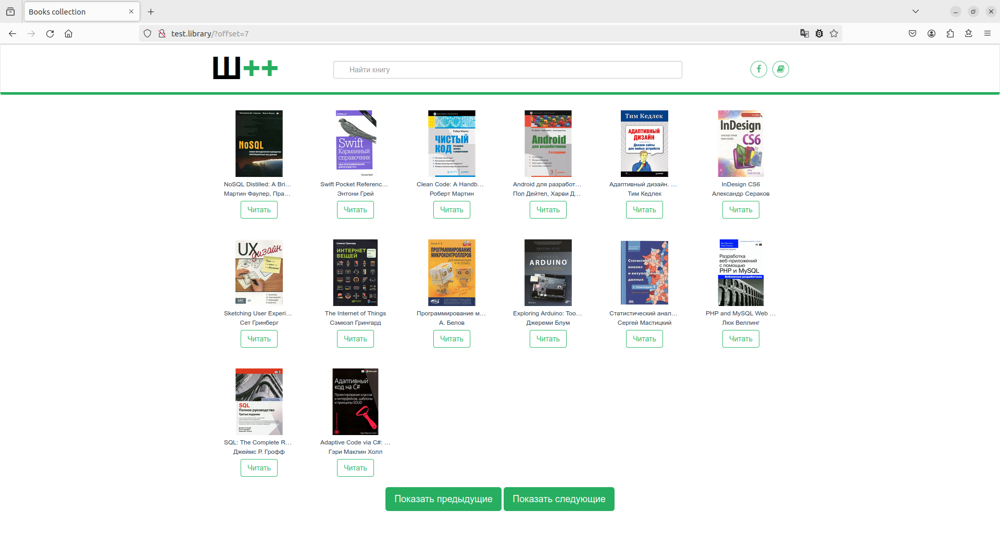
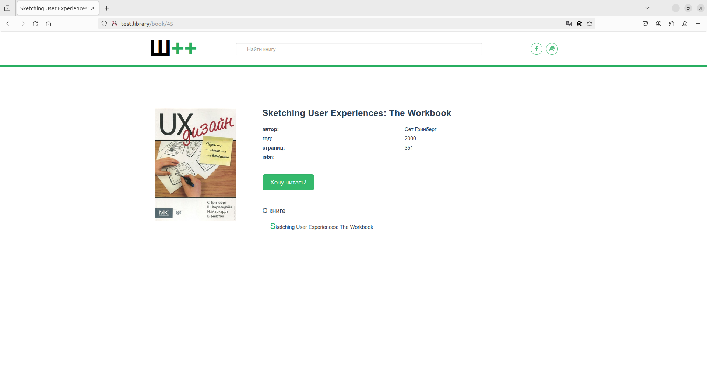
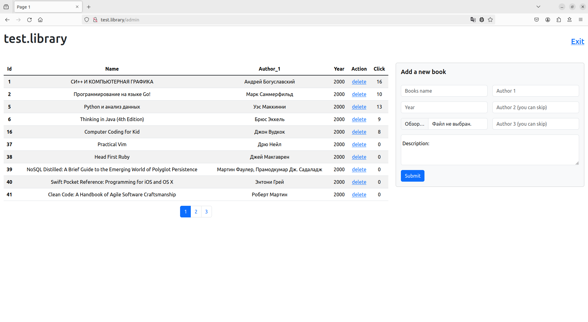
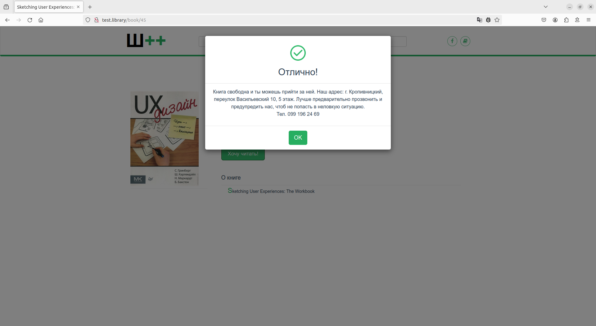

# What it is?

Это учебный проект "backend course 2020 - level 3" от **[Ш++](https://programming.org.ua)**.
Суть в написании приложения-библиотеки на самописном фреймворке. 
Templates, router, MVC, migrations, bootstrap, hasMany / hasOne, JOIN, basic auth, cron.
Проект **не по методичке**. Задание - ТЗ с указанием обязательных решений.
Проект не менторился и является этапом моего самостоятельного изучения PHP backend.

>Для запуска проекта нужно скопировать всю деррикторию,
заполнить constants.php своими данными и запустить миграцию,
введя в адресную строку my.site/migrate. Разработка велась в
> [докер контейнерах](https://github.com/sprintcube/docker-compose-lamp),
> возможны ошибки прав доступа к некоторым папкам и файлам. 

## Realisation features

**Configuration** - константы для подключения к базе данных
и управления пагинацией на страницах пользователя и админа находятся в app/config/constants.php.

**User pages** - подключил готовую верстку страницы списка книг и страницу отдельной книги.
Поскольку задача построить безаджаксовый сайт, все "лишнее" из верстки я удалил.
libs.min.css и style.css подключены без каких-либо изменений.




**Admin page** - сверстал на bootstrap.



**Basic auth** - залогиниться не проблема, проблема разлогиниться.
Найдено чудесное решение, работающее без рестарта Firefox. Нажатие ссылки **Exit** должно вернуть:
```HTML
<div>You have been logged out. Redirecting to home...</div>    

<script>
    var XHR = new XMLHttpRequest();
    XHR.open("GET", "/Home/MyProtectedPage", true, "no user", "no password");
    XHR.send();

    setTimeout(function () {
        window.location.href = "/";
    }, 3000);
</script>
```

**Popup** - в уже предоставленном с фронтом libs.min.css есть классы для модальных окон.
Нужно либо писать свой CSS под свои классы, либо использовать существующие.
Я выбрал второе, а недостающие свойства включил в html-теги моего попапа.



**Click count** - скрипт лежит в click.js, которым я заменил предоставленный book.js.
В нем же код для отображения модального окна.

**Exeptions** - ошибки обрабатывает статический метод ResponseHandler::sendError.
Он возвращает статус-код ошибки и JSON с ее описанием.
С msqli мне не удалось перехватить ошибки подключения к базе данных,
поэтому я переписал запросы с PDO и все заработало как надо.
Я перехватываю ошибку подключения к базе данных, ввода неправильного URI,
записи файла обложки книги.

**Security** - GET запросы проблем не создадут,
поскольку uri проверяются на соответствие паттерну в Router.
В админке есть  POST форма добавления книги,
в моделе Admin Page делаю очистку ввода и подготовку запроса.
Очистку данных после извлечения данных из базы делаю в родительском классе Model.
Форма со скриптом предварительной валидации: количество символов,
только цифры в поле года и формат файлов jpg, jpeg, png, gif.

**Migration** - в папку migrations складываю все файлы миграции.
История миграций храниться в таблице versions базы данных.
Очередность запуска определяется числом в начале имени файла миграции.
Миграция запускается my.site/migrate с авторизацией.

**Soft Deletion** - my.site/clean выполняет удаление книг, помеченных для удаления,
их связей с авторами и файл изображения обложки.

**Cron** - скрипты и папка для резервных копий находятся в папке cron. 
Я использую докер контейнеры, поэтому в таблице задач cron присутствует вход в контейнеры `docker exec`. 
Также я примонтировал папку home контейнера mysql к локальной папке www. 
В таблицу задач cron `crontab -e` я добавил строки:
```
0 0 * * * docker exec lamp-php83 /var/www/html/101/shpp_3/cron/clean.sh

0 0 * * * docker exec lamp-mysql8 /home/101/shpp_3/cron/backup_db.sh

```

## Personal notes
Годный материал по написанию простого MVC фреймворка
[здесь](https://reintech.io/blog/building-php-mvc-framework-from-scratch)
и [здесь](https://code.mu/ru/php/book/oop/mvc/framework/intro/).

Статья "[Securing PHP Applications: Input Sanitization and Best Practices](https://reintech.io/blog/securing-php-applications-input-sanitization-best-practices)" про безопасность PHP кода.

[Статья](https://webdevkin.ru/posts/backend/mysql-migrations) о простой организации миграции.

